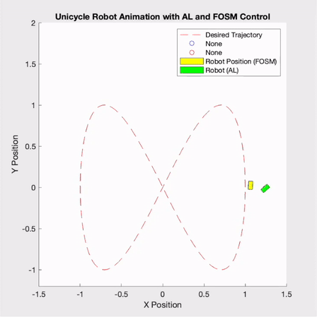
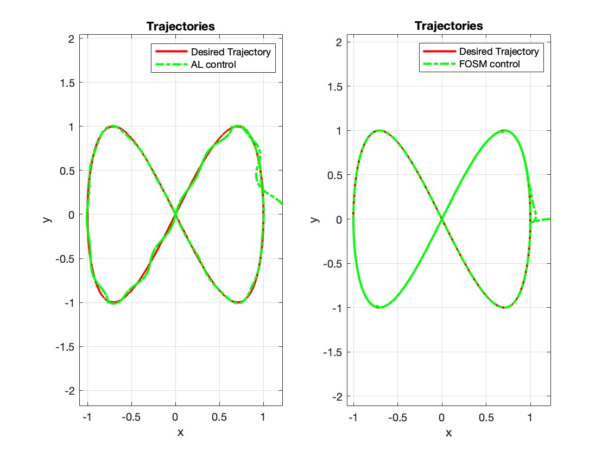
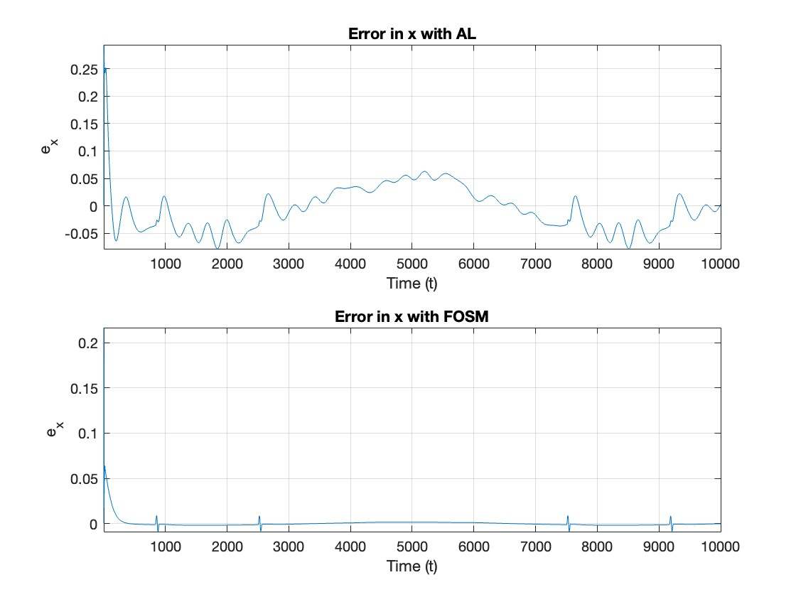
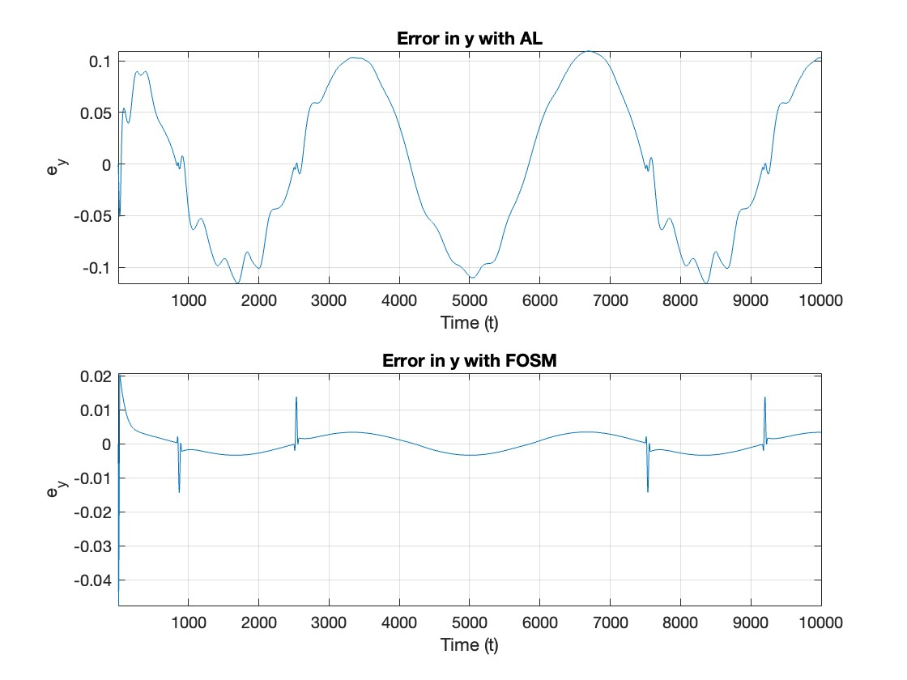
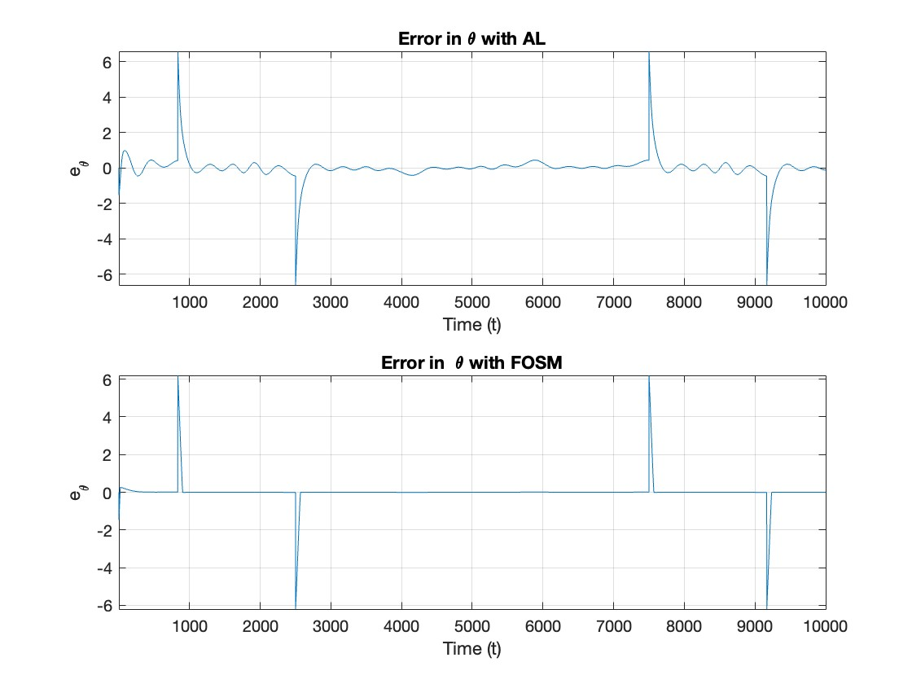

# FOSM-AL Controls comparison of a perturbed Unicycle model
In this project I compare the "First Order Sliding Mode" (FOSM) Control [1] with the classical "Approximate Linearization" (AL) Control in the case of a Perturbed Unicycle Model. 

# Usage
1. Clone the repository:  
 ```sh 
 git clone "https://github.com/cybernetic-m/fosm_control_pertubed_unicycle.git"
 cd fosm_control_perturbed_unicycle
 ```

2. Open and run the "main.m" file


# Project Structure 

```sh 
fosm_control_perturbed_unicycle
├── LICENSE
├── Papers
├── README.md
├── controller
│   ├── al_control.m => Approximate Linearization Controller
│   ├── fosm_control.m => FOSM Controller
│   └── utils
│       └── my_sign.m => Function to compute in a continuous way the sign function
├── gif_images
│   ├── e_theta_large.jpg
│   ├── e_x_large.jpg
│   ├── e_y_large.jpg
│   ├── gif_fosm.gif
│   └── traj_large.jpg
├── main.m => Main file for the simulations
└── utils
    └── trajectory.m => To generate Circle and Lemniscate Curves
 ```

# Usage
To use the project you can run the "main.m" file choosing:
1. Trajectory types: Circle or Lemniscate (Infinity) curves
2. Disturbances: Zero, Small or Large Disturbances

# Video



# Trajectories
 


# Error in x


# Error in y


# Error in orientation


# References
[1]. [M. Mera, H. Rios, E. A. Martinez: A sliding-mode based controller for trajectory tracking of perturbed Unicycle Mobile Robots](https://tinyurl.com/bdet5nx4).


